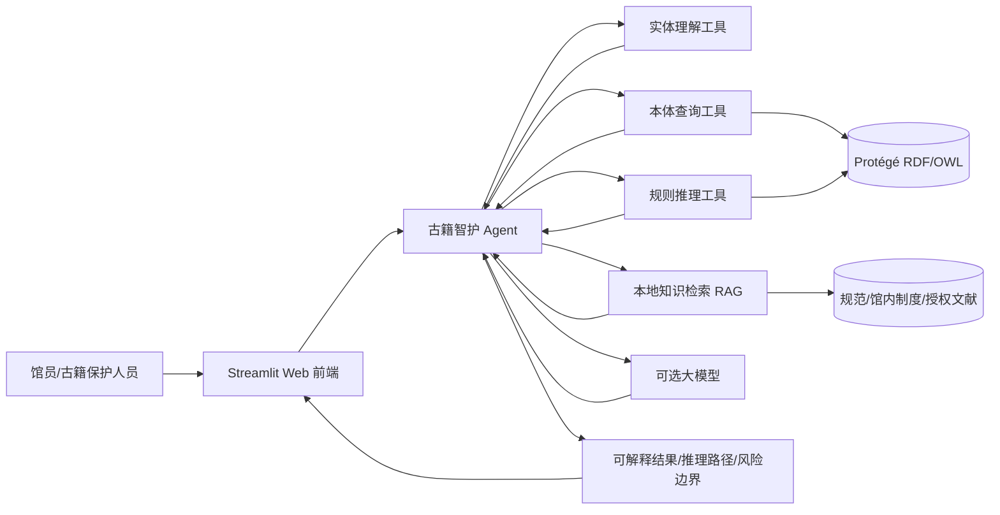

# 系统架构（比赛版）

```mermaid
flowchart LR
    U[馆员/古籍保护人员] --> UI[Streamlit Web 前端]
    UI --> A[古籍智护 Agent]
    A --> E[实体理解工具]
    A --> O[本体查询工具]
    A --> R[规则推理工具]
    A --> K[本地知识检索 RAG]
    A --> L[可选大模型]
    O --> RDF[(Protégé RDF/OWL)]
    R --> RDF
    K --> DOC[(规范/馆内制度/授权文献)]
    E --> A
    O --> A
    R --> A
    K --> A
    L --> A
    A --> X[可解释结果/推理路径/风险边界]
    X --> UI
```

核心设计不是让大模型“凭感觉”决定修复方案，而是把古籍、病害和工序的结构化关系保存在本体中，由规则层产生可审计的候选工序；大模型仅负责自然语言理解和结果组织。
